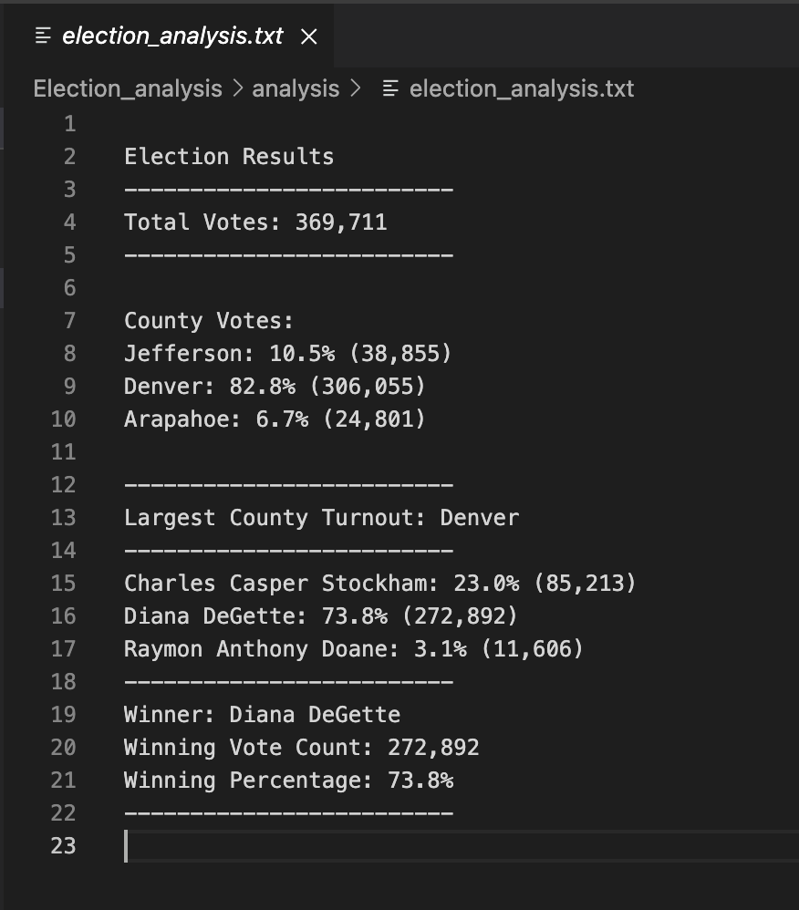

# Election Results Analysis using Python

## Overview of Election Audit
The purpose of the election audit analysis is to become familiar with Python and Visual Studio Code. Python is a popular programming language that we used in this exercise to write code to extract the requested data from the election results dataset. We used Visual Studio Code as our IDE (Integrated Studio Environment) to write, test, and save our code. In this module, we performed an audit of election results to be submitted to the Colorado Board of Elections. The information we need to extract from the dataset is total numbers of votes cast, number and percentage of votes that were cast in each county, list of candidates who received votes, total number of votes for each candidate, percentage of votes won by each candidate, and the winner of the election. 

## Election-Audit Results
* A total of 369,711 votes were cast in this congressional election
* The following provides a breakdown of the total number of votes and percentage of total votes for each county in the precinct:
	* Jefferson County: 38,855 votes (10.5% of total votes)
	* Denver County: 306,055 votes (82.8% of total votes)
	* Arapahoe County: 24,801 votes (6.7% of total votes)
* Denver County had the largest number of votes
* The following provides a breakdown of the number of votes and percentage of total votes received by each candidate:
	* Charles Casper Stockham: 85,213 votes (23.0% of total votes)
	* Diana DeGette: 272,892 votes (73.8% of total votes)
	* Raymon Anthony Doane: 11,606 votes (3.1% of total votes)
* Diana DeGette won the election with 272,892 votes which consisted of 73.8% of the total votes 

## Election-Audit Summary
In order to use this script for any election, the script will need to be slightly revised. First, the csv file containing the election results will need to be read and analyzed by the script. This would require a slight change to this line of code `file_to_load = os.path.join("Resources", "election_results.csv")`. There may be necessary changes depending on the type of election is being held. For example, a breakdown of votes by state as opposed to votes by county may be preferred in a presidential election. If that is the case, we can change instances of "county" in our code to "state." For the current congressional election, the county votes and percentages were calculated and printed to our txt file (see below). Depending on the type of election, we can change the output information from county to state so the results are appropriate for the election. 

